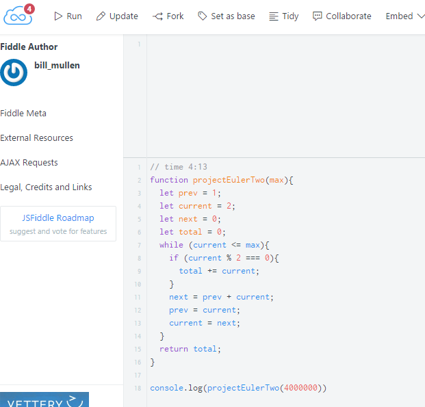

---

layout: essay

type: essay

title: Configuration Management
date: 2016-09-12

labels:

  - Software Engineering

  - Learning

---

The first time I ran into the issue of configuration management, or at least version control, was not in a software context. At the time, about a decade ago, I was getting my first bachelor's degree and working at the copy desk of the student newspaper.

## On Git

