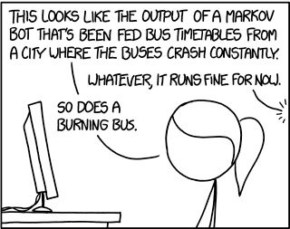

---

layout: essay

type: essay

title: Triviality and Practicality
date: 2016-09-12

labels:

  - Coding standards

  - Code Quality Tools

  - Style Guides

---

<blockquote>Excerpt from <a href="http://xkcd.com/1695/">xkcd #1695</a> by Randall Munroe.</blockquote>

As a former copyeditor, I'm prone to attention to detail, but I try to avoid being punctilious. Most supposed grammar “rules” in English – at least those that people frequently get “wrong” – are actually stylistic choices, and often questionable choices at that. 

So while it was, I’ll admit, particularly frustrating to enforce Associate Press style when it went against my own years-entrenched writing habits, I appreciated that the rules of AP style were particularly suited to their own medium.

So too I try to find ways to appreciate the reasoning behind coding styles that I’m not used to. Even when they ask me to use two- or four-spaced indents, instead of three.

# Form and function

It has been suggested (by Prof. Philip Johnson, among others) that coding standards can help you learn a programming language. But I'd go a step further in saying coding standards can teach you how to write programs.

Specifically, I’m thinking of my very first programming class. At that level there was a fair amount of flexibility in what style you could use. We were free to have slight variations from the professor’s own style so long as we were internally consistent, and so long as our style made some kind of sense. For example, both of these would be okay:

```
if (comparison) {
	do something;
} else {
	other thing;
}
```

```
if (comparison) 
{
	do something;
} 
else 
{
	other thing;
}

```

But emphasis was placed on consistency and readability, and to that end we were graded (read: potentially downgraded) on style. Furthermore, this was the first time I was shown what proper style looked like. So, with very few exceptions, I adopted the style as it was shown.

This included some very basic principles, like when to indent, that are fairly universal across programming languages. As another example, the principle of going to the next line following every semicolon. One makes the code machine-readable, the other makes it human-readable. And very clearly, you shouldn’t do one without the other. So the takeaway is that form equals function, function equals form. The two go hand-in-hand.

It may seem reductive to use such a basic example. But why should trickier, language-specific examples be any different? When ESLint presents an “error” message that’s a little confusing, it’s usually not an arbitrary thing. Typically, there is something about the language that I don’t fully understand, or haven’t groked to the point that I’m coding it the right way consistently. 

# Scalability

The major benefit of coding standards comes with group projects, so that everyone can understand, edit, and interact with everyone else’s code. While I soon will dip my toes in this arena, that’s not an aspect of programming I’ve yet experienced. 

But I did work in publishing for several years, and you can see echoes of this principle in any office setting. What is the result of a shared drive without any enforced folder hierarchy or naming conventions? Eight different folders for the same thing, in eight different locations, and no way to tell which of them – if any – contains the correct and current version of the file you need.

And even just working with my own code, the need for consistency is apparent. Many assignments have required revisions to previous assignments, and plenty of projects are complex enough to warrant significant revisions as you realize some part isn’t working, or, ideally, that some portion could be streamlined. Without sufficient consistency, without well-named variables, how quickly your own brain becomes your worst enemy. It’s quite easy to imagine the pitfalls of trying to wrangle someone else’s messy code or, worse, realizing you’ve put someone else through that!

# When triviality becomes practical

Let me just say, I am so grateful for code quality tools. We’ve been using ESLint, and I’m surprised I haven’t encountered something similar in previous classes. I’d say it’s the best thing since sliced bread, but frankly, I’m starting to think that sliced bread is overrated.

For the major issues – whether it’s readability issues, or remembering when to use “const” instead of “let”, I love having the in-line reminders, even if it means I need to take extra care than I otherwise would. You learn new things by practice, not by waiting for that super-frustrating time-wasting crunch when your bad habits finally cause a major bug you can neither understand nor locate.

That’s all well and good for the important stuff – and I definitely include readability as important – but in any formalized standard there’s going to be something you disagree with, or simply don’t understand. For me, I’m not a huge fan of template literals; concatenation seems fine to me. 

But I’m pretty sure that’s just because I’m used to them. And, rather than having to make my code fit a standard, wouldn’t it be all the more annoying if I was working with a programmer who habitually used their own coding style, with their own quirks? Wouldn’t it be better if everyone can conform to something, even if I would prefer that something to be slightly different? It might be the social contract in microcosm, and I have no problem with that.

Here too, code quality tools are perfect. Even if the reason for a particular standard seems trivial to me, it is simply so easy to conform to it, and consequently, get used to the standard. So fixing code, even for trivial reasons, becomes, well, trivial.
